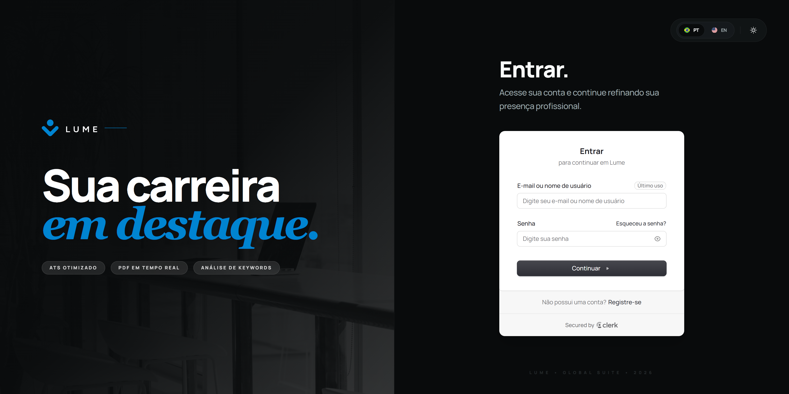
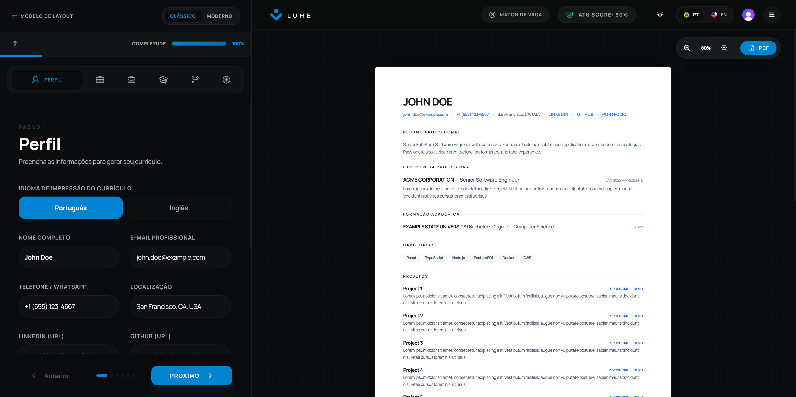
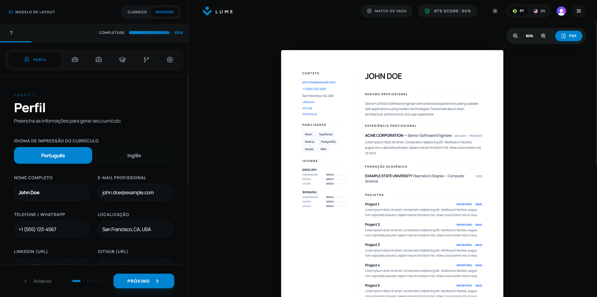
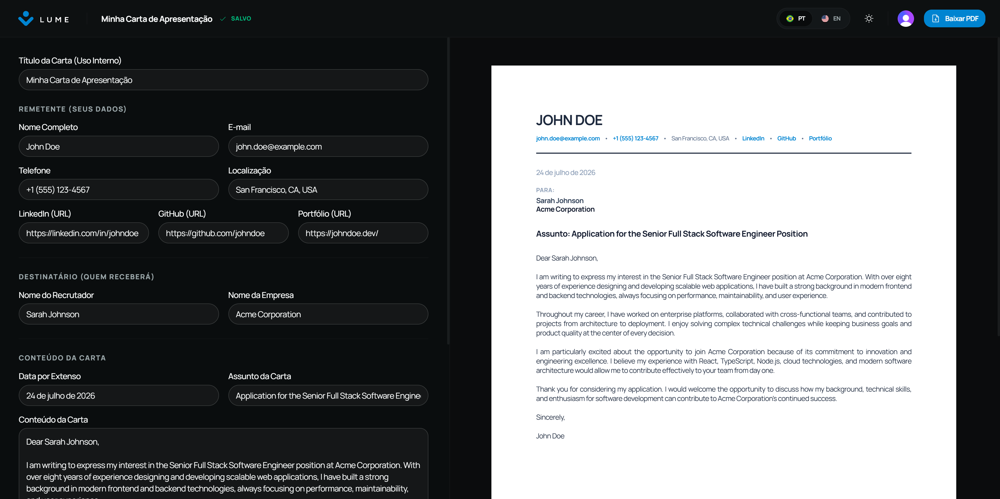
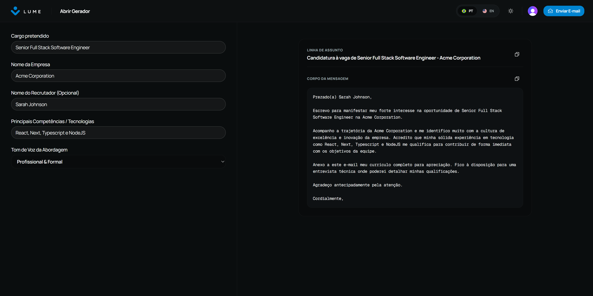
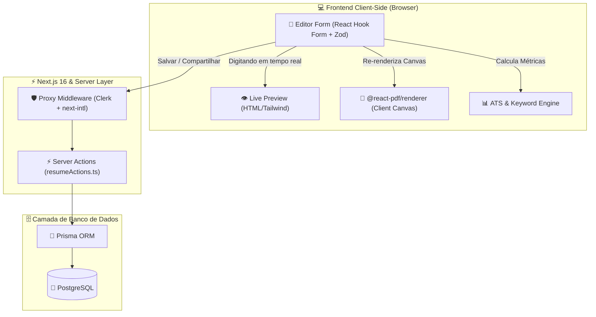
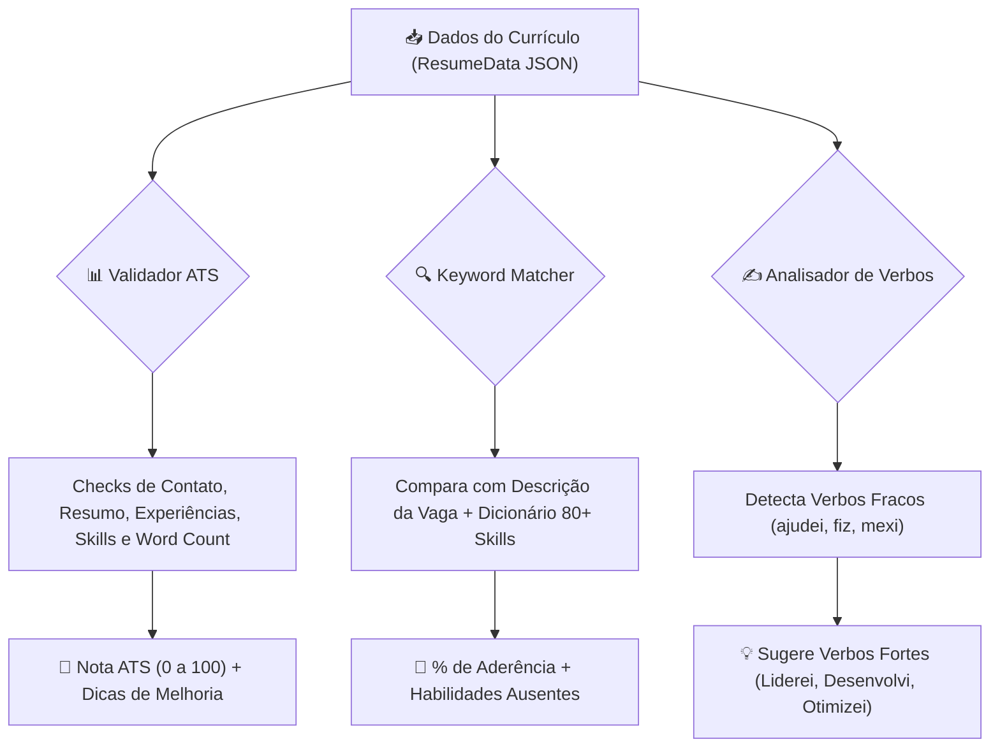
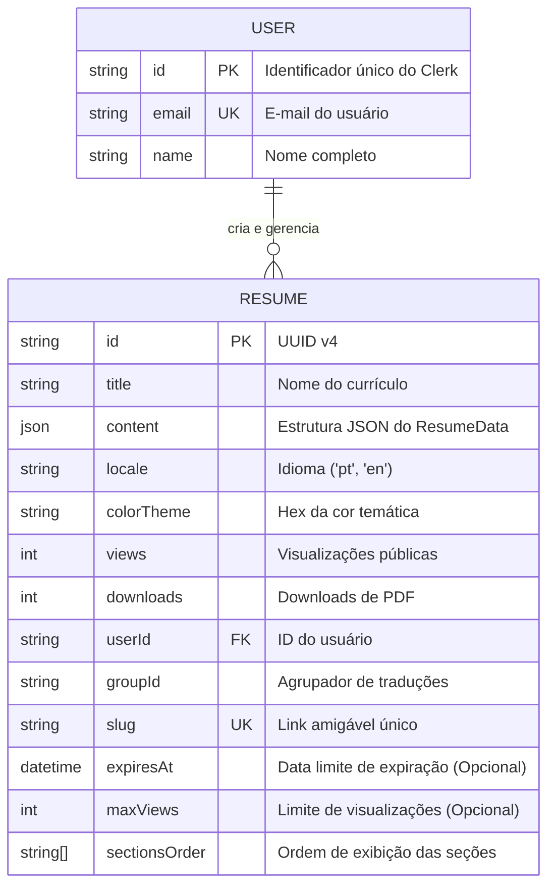
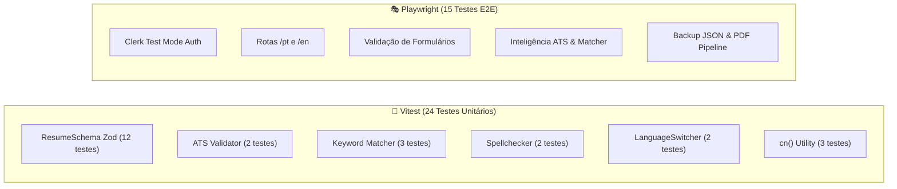

<div align="center">
  <br/>
  <br/>
  
</div>

<br />

## 🌟 Visão Geral

O **Lume** é uma plataforma profissional de candidaturas desenvolvida para ajudar candidatos a criar, gerenciar e otimizar todo o seu ecossistema de apresentação profissional (currículos de alta performance, cartas de apresentação elegantes e mensagens de e-mail personalizadas para recrutadores).

A plataforma permite estruturar informações de forma clara, validar currículos contra leitores ATS, organizar documentos por tags, e exportar currículos e cartas diretamente para PDF de alta qualidade com suporte total a múltiplos idiomas.

## 🚀 Deploy & Demonstração

O projeto está implantado e pronto para uso em produção no seguinte endereço:
👉 **[https://lume.guibus.dev/](https://lume.guibus.dev/)**

## 📸 Galeria







## 🛠️ Stack Tecnológica

<div align="center">
  
  
  
  
  
  
  
  
  
  
  
  
  
  
  
  
  
  
  
  
  
  
  
</div>

---

## 🏛️ Arquitetura do Sistema

O Lume utiliza uma arquitetura reativa moderna em que a edição do formulário sincroniza simultaneamente o visualizador em HTML e a compilação do canvas em PDF:



---

## 🚀 Funcionalidades Principais

| Módulo                       | Funcionalidades                                                                                             | Detalhes Técnicos                                                                                                       |
| :--------------------------- | :---------------------------------------------------------------------------------------------------------- | :---------------------------------------------------------------------------------------------------------------------- |
| **📝 Editor de Currículo**   | • Abas categorizadas<br/>• Drag & Drop reordering<br/>• Preenchimento dinâmico                              | Formulário reativo com `@dnd-kit/sortable` e estado gerenciado com validação Zod.                                       |
| **✉️ Carta de Apresentação** | • Editor dedicado integrado<br/>• Visualização HTML em tempo real<br/>• Mesmo estilo de cabeçalho e cor     | Geração de PDF vetorial de página única via `@react-pdf/renderer` com links clicáveis e padrão de nomenclatura limpo.   |
| **📧 Mensagem para E-mail**  | • Assistente de escrita em segundos<br/>• Três opções de tom de voz<br/>• Links `mailto` e cópia rápida     | Integração nativa de modelos dinâmicos de texto dependentes do idioma selecionado no frontend.                          |
| **📄 PDF Engine**            | • Preview instantâneo<br/>• Download direto em Blob<br/>• Temas de cores Hex<br/>• Modelos Clássico/Moderno | Desenvolvido com `@react-pdf/renderer` com suporte a múltiplos templates (1 e 2 colunas) sincronizados entre Web e PDF. |
| **🌐 Internacionalização**   | • Rotas `/pt` e `/en`<br/>• Versões vinculadas por `groupId`<br/>• Seletor dinâmico                         | Suporte completo via `next-intl` com sincronização automática do currículo no idioma correto.                           |
| **🔗 Links Públicos**        | • Slugs curtos e amigáveis<br/>• Métricas de `views` e `downloads`<br/>• Layout público limpo               | Rotas sob `/share/[id]` com incrementadores assíncronos e controle de sessão por cookie.                                |

---

## ⚖️ Motores de Inteligência & ATS



---

## 🗄️ Banco de Dados & Estrutura

O modelo E-R combina a velocidade relacional do PostgreSQL para índices de busca com a flexibilidade do JSON para o conteúdo do currículo:



---

## 🧪 Testes Automatizados (39 Testes)

O projeto conta com uma cobertura completa dividida em testes unitários e testes End-to-End no navegador:



### 🚀 Comandos de Execução

```bash
# Rodar suíte de testes unitários com Vitest
pnpm test

# Rodar suíte de testes E2E com Playwright
pnpm test:e2e

# Interface gráfica interativa do Playwright
pnpm test:e2e:ui
```

---

## 🏁 Inicialização Local

### 1. Clonar e Instalar

```bash
git clone https://github.com/gui-bus/Lume.git
cd Lume
pnpm install
```

### 2. Subir Banco de Dados com Docker

```bash
docker-compose up -d
pnpm prisma migrate dev
```

### 3. Rodar Aplicação

```bash
pnpm dev
```

Abra [http://localhost:3000](http://localhost:3000) no navegador.

---

## 📑 Documentação Técnica Adicional

Para uma imersão profunda em cada módulo da aplicação, consulte a pasta [`/docs`](file:///c:/Users/Guilherme/Desktop/PROJETOS/Lume/docs/README.md):

- 🚀 [**`docs/features.md`**](file:///c:/Users/Guilherme/Desktop/PROJETOS/Lume/docs/features.md): Mapa detalhado de todas as telas e componentes.
- 🏗️ [**`docs/architecture.md`**](file:///c:/Users/Guilherme/Desktop/PROJETOS/Lume/docs/architecture.md): Especificação do Next.js App Router, middleware e PDF Engine.
- 🗄️ [**`docs/database.md`**](file:///c:/Users/Guilherme/Desktop/PROJETOS/Lume/docs/database.md): Modelagem física e estratégia de JSON + PostgreSQL.
- ⚖️ [**`docs/business-rules.md`**](file:///c:/Users/Guilherme/Desktop/PROJETOS/Lume/docs/business-rules.md): Regras de pontuação ATS e dicionário de palavras-chave.
