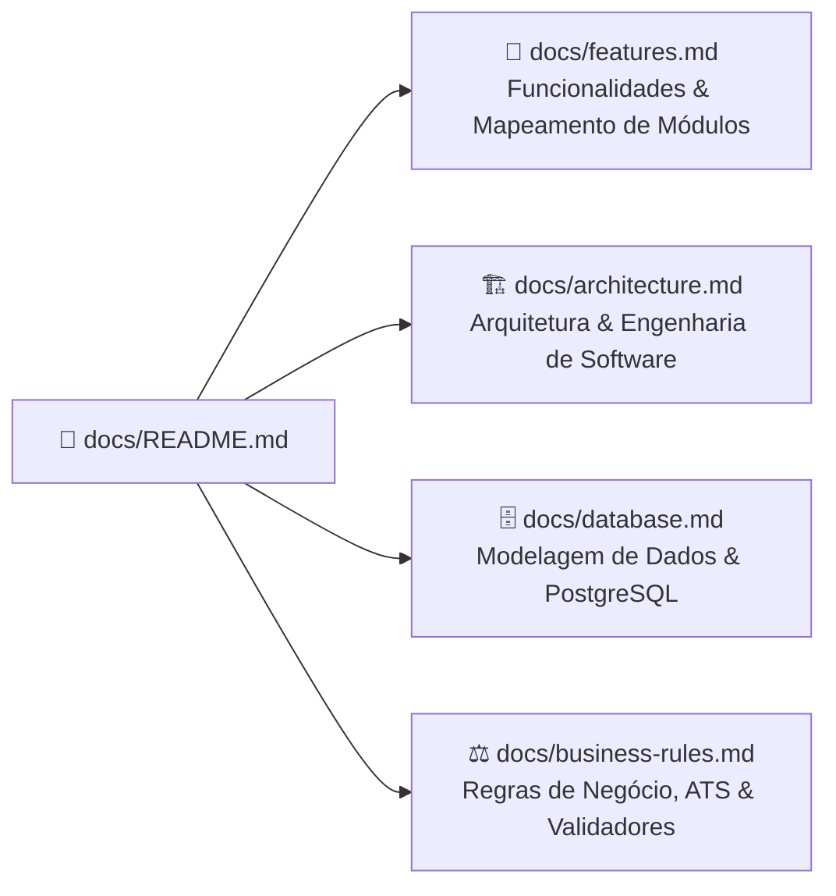
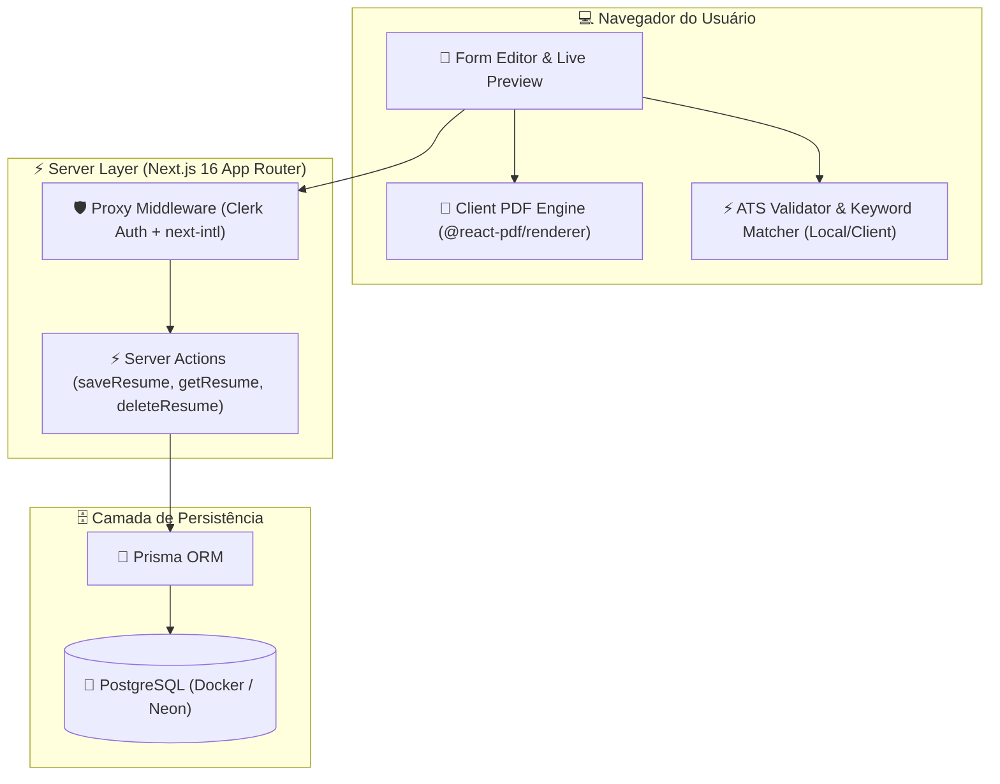

# 📚 Central de Documentação Técnica do Lume

Bem-vindo à central de documentação oficial do **Lume**, a plataforma web moderna desenvolvida para criação, validação ATS, otimização de palavras-chave, tradução multi-idiomas e geração de currículos profissionais em PDF.

Esta pasta reúne a especificação detalhada da arquitetura do sistema, o mapa de funcionalidades implementadas, o modelo de banco de dados e todas as regras de negócio e validações que regem o comportamento da aplicação.

---

## 🗺️ Guia de Navegação na Documentação

A documentação está organizada nos quatro módulos principais abaixo:

### 📋 Módulos de Documentação

| Documento                                                                                                        | Foco                                         | O que você vai encontrar                                                                                                                                                                                                                                                                                 |
| :--------------------------------------------------------------------------------------------------------------- | :------------------------------------------- | :------------------------------------------------------------------------------------------------------------------------------------------------------------------------------------------------------------------------------------------------------------------------------------------------------- |
| 🚀 [**Funcionalidades (Features)**](file:///c:/Users/Guilherme/Desktop/PROJETOS/Lume/docs/features.md)           | Visão Geral do Estado Atual & Mapeamento     | • Estado do projeto e lista completa de funcionalidades ativas • Mapeamento de componentes (Editor, Preview, PDF Engine) • Suíte de ferramentas (ATS, Keyword Matcher, Verbos e Parser do LinkedIn) • Gerenciamento de Slugs, Métricas e Dashboard                                           |
| 🏗️ [**Arquitetura do Sistema**](file:///c:/Users/Guilherme/Desktop/PROJETOS/Lume/docs/architecture.md)           | Engenharia, Camadas e Decisões de Tecnologia | • Visão geral do Next.js 16 App Router e rotas `[locale]` • Integração do Proxy Middleware (Clerk Auth + next-intl) • Por que o `@react-pdf/renderer` é executado no client-side e como funciona • Diagramas de Sequência e Fluxo de Componentes                                             |
| 🗄️ [**Banco de Dados & Modelo**](file:///c:/Users/Guilherme/Desktop/PROJETOS/Lume/docs/database.md)              | Estrutura de Dados & Relacionamentos         | • Diagrama ERD completo com suporte a multi-idiomas • Detalhamento das tabelas `User` e `Resume` • Decisão do modelo híbrido (Metadados Relacionais + Coluna JSON) • Mecanismos de índices compostos `(groupId, locale)` e `slug` único                                                      |
| ⚖️ [**Regras de Negócio & Validações**](file:///c:/Users/Guilherme/Desktop/PROJETOS/Lume/docs/business-rules.md) | Algoritmos, Lógica e Validações de Currículo | • Cálculo completo de pontuação do motor **ATS Validator** (0 a 100 pts) • Algoritmo do **Keyword Matcher** e dicionário de 80+ habilidades tecnológicas • **Spellchecker & Verbos de Ação**: Tabela de substituição de verbos fracos • Especificação detalhada dos schemas de validação Zod |

---

## 💡 Visão de Alto Nível da Plataforma

---

> [!NOTE]
> Para consultar as diretrizes e regras de contribuição e desenvolvimento do projeto (como o padrão de não utilizar comentários `//`), acesse o arquivo de diretrizes na raiz: [AGENTS.md](file:///c:/Users/Guilherme/Desktop/PROJETOS/Lume/AGENTS.md).
