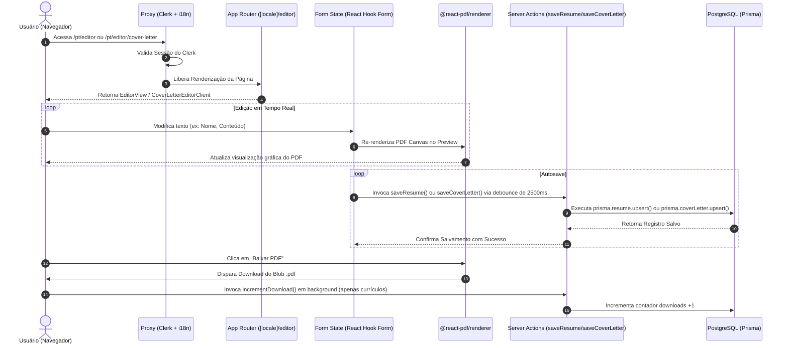
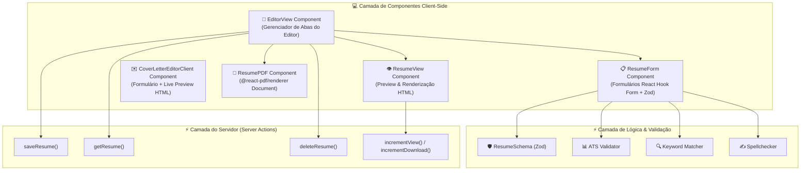

# 🏗️ Arquitetura do Sistema & Decisões Técnicas

Este documento descreve detalhadamente a arquitetura de software do **Lume**, explicando a divisão de camadas, os fluxos de dados entre cliente e servidor, a integração de serviços e as justificativas técnicas por trás de cada decisão tecnológica adotada.

---

## 1. ⚙️ Visão Geral da Stack Tecnológica & Justificativas

### 🟢 Next.js 16 (App Router)

- **Por que usamos**: O App Router permite combinar Server Components (para carregamento ultrarrápido de páginas públicas e SEO otimizado) com Client Components dinâmicos para a interface interativa do editor.
- **Roteamento por Locale (`[locale]`)**: Permite internacionalização nativa utilizando o `next-intl`. A rota `/pt/editor` ou `/en/editor` carrega as traduções e o estado local sem necessidade de recarregar a aplicação inteira.

### 🟡 Autenticação Gerenciada com Clerk & Middleware (`proxy.ts`)

- **Por que usamos**: O Clerk lida com todo o ciclo de vida da sessão do usuário, login social (Google/GitHub), verificação de e-mail e emissão de tokens JWT com zero manutenção de infraestrutura de auth.
- **Funcionamento do `src/proxy.ts`**:
  O middleware unificado combina a proteção de rotas do Clerk com o middleware de internacionalização do `next-intl`:
  ```typescript
  export default clerkMiddleware(async (auth, req) => {
    if (!isPublicRoute(req)) {
      await auth.protect();
    }
    return intlMiddleware(req);
  });
  ```
  Rotas públicas como `/`, `/sign-in`, `/sign-up` e `/share/[id]` são liberadas sem autenticação. Qualquer outra rota privada (como o editor) exige que o usuário esteja autenticado.

### 🔴 Renderização de PDF Client-side com `@react-pdf/renderer`

- **Por que usamos (Decisão do Engine de PDF)**:
  Existem duas abordagens tradicionais para gerar PDFs em aplicações web:
  1. _Server-Side Puppeteer (Chrome Headless)_: Abre um navegador headless no servidor Node.js e tira um print/PDF da página. É extremamente pesado, consome centenas de MBs de memória RAM por requisição, atrasa o download em 3 a 5 segundos e encarece o hosting.
  2. _Client-Side Vetorial (`@react-pdf/renderer`)_: Renderiza elementos canvas/vetoriais diretamente no navegador usando React.
- **Vantagens da Escolha**:
  - **Zero Custo no Servidor**: O servidor Node.js não gasta CPU nem RAM gerando PDFs.
  - **Live Preview Instantâneo**: À medida que o usuário digita suas informações no formulário, o documento PDF é atualizado em milissegundos dentro de um `<iframe>` ou `<canvas>`.
  - **Download Imediato**: Ao clicar em "Baixar PDF", o blob já está gerado na memória do browser e o download começa instantaneamente.

---

## 2. 🔀 Fluxos de Dados e Sequência de Chamadas

### 🔄 Fluxo Completo: Edição, Salvamento e Exportação



---

## 3. 🧩 Visão de Componentes da Aplicação



---

## 4. 🌐 Estrutura de Rotas e Internacionalização (i18n)

O sistema suporta múltiplos idiomas tanto na interface do usuário quanto no conteúdo do próprio currículo:

1. **Rotas com Prefixo de Locale**:
   - `/pt`: Interface em Português.
   - `/en`: Interface em Inglês.
2. **Grupos de Idioma de Currículo (`groupId`)**:
   - Um usuário pode ter o mesmo currículo em múltiplos idiomas.
   - No banco de dados, o campo `groupId` vincula o currículo "Desenvolvedor Fullstack (PT)" com "Fullstack Developer (EN)".
   - Ao alternar a linguagem no topo da página, a Server Action busca automaticamente a versão correspondente do mesmo `groupId`.
