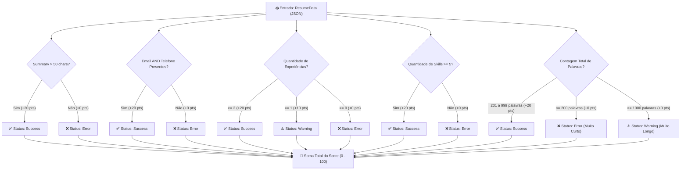

# ⚖️ Regras de Negócio, Otimizações & Algoritmos de Validação

Este documento apresenta a especificação matemática, os algoritmos e a lógica de validação que compõem os motores de inteligência e qualidade do **Lume**:

1. **Motor de Compatibilidade ATS** (`atsValidator.ts`)
2. **Motor de Otimização de Palavras-Chave de Vagas** (`keyword-matcher.ts`)
3. **Motor de Melhoria de Verbos / Spellchecker** (`spellchecker.ts`)
4. **Esquemas Estritos de Validação de Dados** (`resume-schema.ts`)

---

## 1. 📊 Validador ATS (Applicant Tracking System)

Os sistemas ATS são utilizados por recrutadores para filtrar automaticamente currículos em massa. O algoritmo do Lume analisa a estrutura do currículo e calcula uma pontuação de **0 a 100 pontos**, dividida em 5 pilares fundamentais (20 pontos cada).



### Table de Critérios de Avaliação ATS

| ID do Check  | Condição Testada                 | Resultado se Válido                            | Resultado se Parcial / Erro                                                                                | Pontuação Atribuída                                           |
| :----------- | :------------------------------- | :--------------------------------------------- | :--------------------------------------------------------------------------------------------------------- | :------------------------------------------------------------ |
| `summary`    | Resumo profissional preenchido   | `status: "success"` (> 50 caracteres)          | `status: "error"` (<= 50 caracteres)                                                                       | **20 pontos** se passou; **0** se falhou                      |
| `contact`    | Informações mínimas de contato   | `status: "success"` (Possui Email E Telefone)  | `status: "error"` (Falta Email ou Telefone)                                                                | **20 pontos** se passou; **0** se falhou                      |
| `experience` | Quantidade de experiências       | `status: "success"` (>= 2 experiências)        | `status: "warning"` (1 experiência = 10 pts)<br/>`status: "error"` (0 experiências = 0 pts)                | **20 pontos** (2+)<br/>**10 pontos** (1)<br/>**0 pontos** (0) |
| `skills`     | Variedade de competências        | `status: "success"` (>= 5 habilidades)         | `status: "error"` (< 5 habilidades)                                                                        | **20 pontos** se passou; **0** se falhou                      |
| `length`     | Tamanho do documento em palavras | `status: "success"` (Entre 201 e 999 palavras) | `status: "error"` (<= 200 palavras - Muito curto)<br/>`status: "warning"` (>= 1000 palavras - Muito longo) | **20 pontos** se passou; **0** se falhou                      |

---

## 2. 🔍 Motor de Matcher de Vagas (Keyword Matcher)

Permite ao candidato colar a descrição de uma vaga de emprego e verificar a porcentagem de aderência do seu currículo em relação aos requisitos técnicos solicitados.

### Algoritmo Passo a Passo:

1. **Normalização dos Textos**:
   Remove acentos, converte para minúsculas e elimina caracteres especiais mantendo apenas palavras, pontos e `#` (para suportar `C#` e `Next.js`).
   ```typescript
   const normalize = (text: string) =>
     text
       .toLowerCase()
       .normalize("NFD")
       .replace(/[\u0300-\u036f]/g, "")
       .replace(/[^\w\s.#]/g, " ");
   ```
2. **Extração de Requisitos da Vaga**:
   Filtra o dicionário de skills (`SKILL_DICTIONARY`) contra o texto da vaga utilizando Expressões Regulares com boundary (`\b skill \b`).
3. **Verificação no Currículo**:
   Para cada habilidade encontrada na vaga, o algoritmo verifica se a mesma palavra-chave está presente no JSON do currículo.
4. **Cálculo da Porcentagem de Match**:
   $$\text{Score (\%)} = \text{Math.round}\left( \frac{\text{Quantidade de Skills Coincidentes}}{\text{Total de Skills Solicitadas na Vaga}} \times 100 \right)$$

### Dicionário de Skills Monitoradas (`SKILL_DICTIONARY`)

O sistema identifica automaticamente mais de 80 palavras-chave cruciais da área de tecnologia:

- **Frontend**: `react`, `next.js`, `typescript`, `javascript`, `tailwind`, `css`, `html`, `sass`, `styled-components`, `redux`, `zustand`, `react-query`, `vue`, `angular`.
- **Backend & BD**: `node.js`, `prisma`, `postgresql`, `mysql`, `mongodb`, `go`, `python`, `django`, `flask`, `java`, `spring`, `c#`, `.net`, `php`, `laravel`, `rest`, `graphql`, `microservices`.
- **DevOps & Cloud**: `docker`, `aws`, `azure`, `git`, `github`, `gitlab`, `kubernetes`, `devops`.
- **Processos & UX**: `scrum`, `agile`, `kanban`, `figma`, `ui`, `ux`, `design`.
- **Soft Skills & Idiomas**: `inglês`, `espanhol`, `liderança`, `gestão`, `comunicação`, `resolução de problemas`, `mentoria`, `code review`.

---

## 3. ✍️ Analisador de Verbos de Impacto (Spellchecker)

Recrutadores e sistemas ATS valorizam conquistas descritas com **verbos de ação fortes** no passado ou no presente (ex: _"Concebi"_ em vez de _"Criei"_, _"Liderei"_ em vez de _"Ajudei"_).

O motor analisa o texto das seções **Resumo Profissional** e **Descrição de Experiências** e destaca automaticamente os verbos fracos com alternativas de substituição:

### Tabela de Verbos Fracos e Sugestões de Substituição

| Verbo Fraco Detectado | Alternativas de Forte Impacto Recomendadas        |
| :-------------------- | :------------------------------------------------ |
| `ajudei`              | **Liderei**, **Coordenei**, **Apoiei**            |
| `ajudar`              | **Liderar**, **Coordenar**, **Suportar**          |
| `fiz`                 | **Desenvolvi**, **Executei**, **Entreguei**       |
| `fazer`               | **Desenvolver**, **Executar**, **Implementar**    |
| `participei`          | **Contribuí**, **Colaborei**, **Integrei**        |
| `participar`          | **Contribuir**, **Colaborar**, **Integrar**       |
| `trabalhei com`       | **Especializei-me em**, **Utilizei**, **Dominei** |
| `trabalhar`           | **Atuar**, **Performar**, **Operar**              |
| `responsável`         | **Encarregado de**, **Líder de**, **Gestor de**   |
| `criei`               | **Concebi**, **Projetei**, **Arquitetei**         |
| `criar`               | **Conceber**, **Projetar**, **Arquitetar**        |
| `mexi`                | **Otimizei**, **Ajustei**, **Configurei**         |
| `mexer`               | **Otimizar**, **Ajustar**, **Configurar**         |

---

## 4. 🛡️ Esquemas de Validação Zod (`resume-schema.ts`)

Todas as sub-seções do currículo passam por validações Zod estritas no formulário:

```typescript
export const PersonalInfoSchema = z.object({
  name: z.string().min(2, "Nome é obrigatório"),
  email: z.string().email("E-mail inválido"),
  phone: z.string().optional(),
  location: z.string().optional(),
  linkedin: z.string().url("URL inválida").optional().or(z.literal("")),
  github: z.string().url("URL inválida").optional().or(z.literal("")),
  website: z.string().url("URL inválida").optional().or(z.literal("")),
  summary: z.string().optional(),
});

export const ExperienceSchema = z.object({
  company: z.string().min(1, "Empresa é obrigatória"),
  position: z.string().min(1, "Cargo é obrigatório"),
  location: z.string().optional(),
  startDate: z.string().min(1, "Data de início é obrigatória"),
  endDate: z.string().optional(),
  current: z.boolean(),
  description: z.string().optional(),
});

export const LanguageSchema = z.object({
  name: z.string().min(1, "Idioma é obrigatório"),
  conversation: z.enum([
    "Básico",
    "Intermediário",
    "Avançado",
    "Fluente",
    "Nativo",
  ]),
  writing: z.enum(["Básico", "Intermediário", "Avançado", "Fluente", "Nativo"]),
  reading: z.enum(["Básico", "Intermediário", "Avançado", "Fluente", "Nativo"]),
});
```

---

## 5. ✉️ Regras de Geração de Carta de Apresentação

As cartas de apresentação no Lume seguem regras de formatação e nomenclatura estritas para assegurar uma apresentação elegante aos recrutadores:

- **Links de Contato Interativos**: Qualquer URL ou informação de contato do remetente (Email, Telefone, LinkedIn, GitHub e Portfólio) deve ser renderizada com cor de destaque azul (`#3b82f6`) e ser clicável diretamente tanto na visualização HTML quanto no PDF baixado.
- **Formatação de Nome de Arquivo**: Ao exportar o PDF, o nome do arquivo é automaticamente formatado para maiúsculas, removendo acentos e caracteres especiais, e substituindo espaços por underscores:
  `CARTA_DE_APRESENTACAO_[NOME_DO_SENDER_EM_MAIUSCULAS].pdf`.

---

## 6. 📧 Lógica de Tom de Voz no Gerador de E-mails

O gerador de e-mails auxilia o candidato a criar mensagens rápidas de candidatura usando três variações de tons de voz predefinidas:

- **Formal**: Mensagem tradicional e polida, ideal para empresas corporativas.
- **Amigável**: Linguagem moderna, ideal para startups e empresas de tecnologia.
- **Direto**: Mensagem curta e concisa, focada no tempo do recrutador.

Ambos assunto e conteúdo do e-mail são dinamicamente traduzidos de acordo com a localidade ativa na sessão (português ou inglês) e suportam preenchimento com fallback para cargos/empresas indefinidos.
