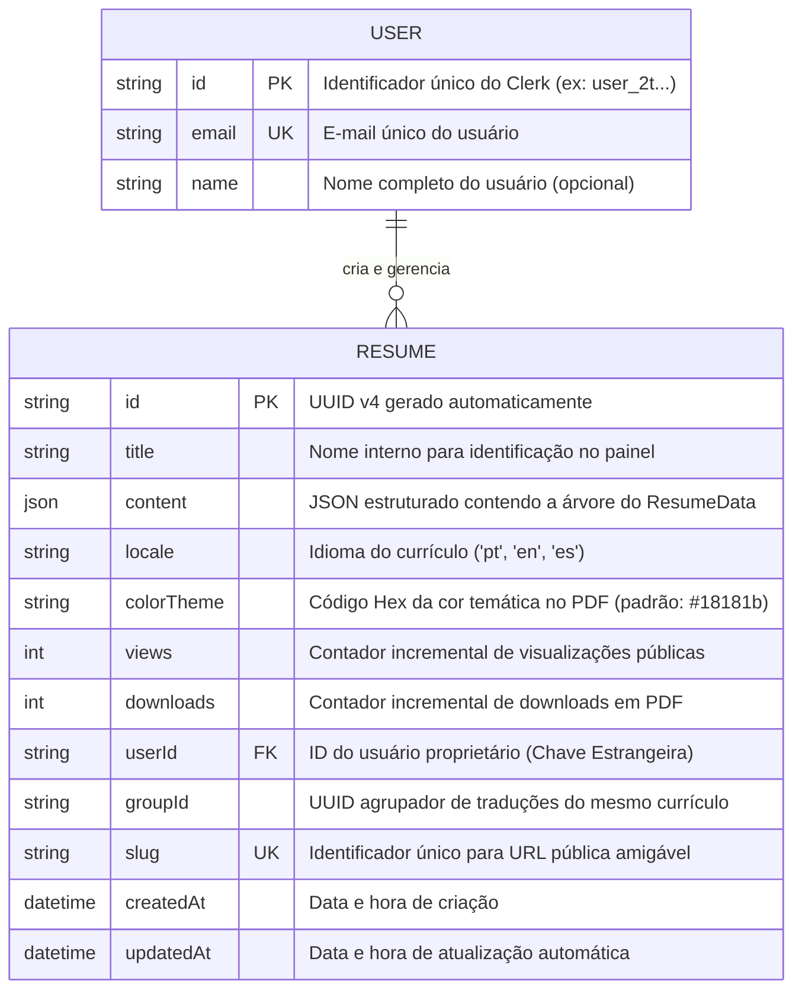

# 🗄️ Modelo de Banco de Dados, Persistência & Decisões de Modelagem

Este documento descreve detalhadamente a modelagem do banco de dados PostgreSQL do **Lume**, as razões por trás do modelo relacional híbrido escolhido e o funcionamento dos índices e restrições de integridade.

---

## 1. 💡 Por que Escolhemos um Modelo Relacional Híbrido (PostgreSQL + Prisma + JSON)?

No desenvolvimento de builders de currículos, existe um dilema clássico de modelagem:

1. **Abordagem Totalmente Relacional (Normalizada)**:
   - Criar tabelas como `Experience`, `Education`, `Skill`, `Project`, `Language`, `Certification` com foreign keys para `ResumeId`.
   - _Problema_: Exige dezenas de `JOINs` complexos a cada consulta de currículo. Qualquer alteração nos campos de uma seção (ex: adicionar um campo "modalidade" em experiência) exige migrações pesadas de banco (`ALTER TABLE`) e gera auto-lock na tabela.
2. **Abordagem de Documentos (NoSQL - MongoDB)**:
   - Salvar o currículo como um documento JSON.
   - _Problema_: Perde o relacionamento rígido com o usuário (`User`), dificulta garantir unicidade de URLs públicas (`slug`) e perde a transacionalidade ACID do PostgreSQL.

### 🎯 A Solução Escolhida: PostgreSQL Relacional com Coluna `content Json`

Decidimos utilizar o **PostgreSQL** através do **Prisma ORM**, combinando o melhor dos dois mundos:

- **Tabelas Relacionais e Colunas Chave** (`id`, `title`, `locale`, `slug`, `groupId`, `views`, `downloads`, `userId`): Garantem buscas ultra-rápidas com índices B-Tree, integridade relacional com a tabela `User` e restrições de unicidade.
- **Coluna `content Json`**: Armazena toda a árvore de dados do currículo (experiências, formações, skills, projetos). Isso garante performance imbatível (1 única leitura sem JOINs), flexibilidade total de esquema e simplifica o envio e salvamento direta com os schemas do Zod.

---

## 2. 📐 Diagrama Entidade-Relacionamento (ERD)



---

## 3. 📋 Schema do Prisma Explicado Registro a Registro

Abaixo está o arquivo `prisma/schema.prisma` com anotações explicativas sobre a finalidade de cada configuração:

```prisma
generator client {
  provider = "prisma-client-js"
}

datasource db {
  provider = "postgresql"
  url      = env("DATABASE_URL")
}

model User {
  id      String   @id
  email   String   @unique
  name    String?
  resumes Resume[]
}

model Resume {
  id          String   @id @default(uuid())
  title       String
  content     Json
  locale      String   @default("pt")
  colorTheme  String   @default("#18181b")
  views       Int      @default(0)
  downloads   Int      @default(0)
  userId      String?
  user        User?    @relation(fields: [userId], references: [id])
  createdAt   DateTime @default(now())
  updatedAt   DateTime @updatedAt

  groupId String
  slug    String?  @unique

  @@unique([groupId, locale])
  @@index([userId])
}
```

---

## 4. 🔒 Índices e Regras de Integridade Explicadas

### 1. `@@unique([groupId, locale])` - Garantia de Tradução Única

- **Objetivo**: Garantir que em um mesmo grupo de currículo (`groupId`), não seja possível criar duas versões com a mesma linguagem (ex: duas versões `pt`).
- **Comportamento na Server Action (`saveResume`)**:
  Quando o usuário edita um currículo em `pt`, o sistema busca pela combinação `groupId` + `locale`. Se já existir, executa um `update`; caso contrário, executa um `create`.

### 2. `slug String? @unique` - URL Amigável para Compartilhamento

- **Objetivo**: Permite que o usuário defina uma URL pública e personalizada para seu currículo (ex: `lume.dev/share/gui-bus`).
- **Validação de Colisão**:
  Antes de salvar um `slug`, a Server Action verifica se ele já está em uso por outro `groupId`. Se estiver, lança a exceção: `"Este link personalizado já está em uso por outro usuário."`.

### 3. `@@index([userId])` - Alta Performance na Dashboard

- **Objetivo**: Criar um índice B-Tree na coluna `userId`.
- **Impacto**: Ao abrir o painel do usuário, a query `prisma.resume.findMany({ where: { userId } })` executa em tempo sub-milissegundo, evitando um Table Scan no banco de dados.

---

## 5. 📦 Estrutura Completa do Objeto `content` (JSON)

A coluna `content` segue estritamente a especificação do `ResumeData` em TypeScript:

```json
{
  "personalInfo": {
    "name": "Guilherme Bus",
    "email": "gui@example.com",
    "phone": "+55 11 99999-9999",
    "location": "São Paulo, SP - Brasil",
    "linkedin": "https://linkedin.com/in/guilherme",
    "github": "https://github.com/guilherme",
    "website": "https://guilherme.dev",
    "summary": "Desenvolvedor de Software com 5+ anos de experiência liderando projetos web..."
  },
  "experiences": [
    {
      "company": "Tech Company Inc.",
      "position": "Engenheiro de Software Senior",
      "location": "Remoto",
      "startDate": "2022-01",
      "endDate": "",
      "current": true,
      "description": "Liderei a migração de microserviços e otimizei a performance da API em 40%."
    }
  ],
  "educations": [
    {
      "school": "Universidade de São Paulo (USP)",
      "degree": "Bacharelado",
      "field": "Ciência da Computação",
      "graduationDate": "2021-12"
    }
  ],
  "skills": [
    "React",
    "Next.js",
    "TypeScript",
    "Node.js",
    "PostgreSQL",
    "Docker",
    "AWS"
  ],
  "projects": [
    {
      "name": "Lume Resume Builder",
      "link": "https://lume.dev",
      "github": "https://github.com/gui/lume",
      "deploy": "https://lume.dev",
      "description": "Plataforma de criação de currículos otimizada para ATS."
    }
  ],
  "languages": [
    {
      "name": "Português",
      "conversation": "Nativo",
      "writing": "Nativo",
      "reading": "Nativo"
    },
    {
      "name": "Inglês",
      "conversation": "Avançado",
      "writing": "Avançado",
      "reading": "Fluente"
    }
  ],
  "certifications": [
    {
      "name": "AWS Certified Solutions Architect",
      "issuer": "Amazon Web Services",
      "date": "2023-05"
    }
  ],
  "volunteering": [],
  "courses": []
}
```
