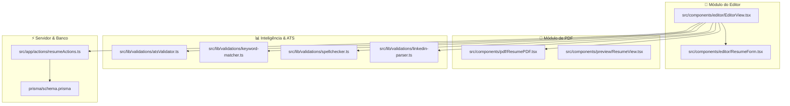

# 🚀 Funcionalidades & Mapeamento de Módulos (Features Overview)

Este documento centraliza todas as funcionalidades implementadas no **Lume**, servindo como um mapa completo para desenvolvedores e agentes de IA entenderem exatamente o estado atual da aplicação, os módulos disponíveis e os componentes responsáveis.

---

## 📌 Status Atual do Projeto

O Lume é uma aplicação totalmente funcional (Production-Ready) com persistência em banco de dados PostgreSQL, autenticação sincronizada via Clerk, suporte completo a internacionalização (i18n), validações em tempo real e geração de PDF vetorial no client-side.

---

## 🎯 Mapeamento Detalhado de Funcionalidades (Features)

### 1. 📝 Editor Formulário Interativo & Estado Reativo

- **Componente Principal**: `src/components/editor/ResumeForm.tsx` e `src/components/editor/EditorView.tsx`
- **Capacidades**:
  - Formulário dinâmico baseado em abas (Informações Pessoais, Experiências, Formação Acadêmica, Habilidades, Projetos, Idiomas, Certificações, Trabalho Voluntário e Cursos).
  - Adição, remoção e reordenação instantânea de múltiplos itens em cada seção.
  - Sincronização em tempo real com os componentes de preview HTML (`ResumeView.tsx`) e canvas PDF (`ResumePDF.tsx`).
  - Preenchimento rápido com dados de exemplo (`defaultData`).

---

### 2. 📄 Engine de Preview e Download de PDF e Modelos de Layout

- **Componentes**: `src/components/pdf/ResumePDF.tsx` e `src/components/preview/ResumeView.tsx`
- **Capacidades**:
  - **Múltiplos Templates (Modelos de Layout)**: Permite alternar entre dois modelos através de um seletor visual e rápido integrado na interface:
    - **Clássico**: Layout tradicional de 1 coluna vertical empilhada.
    - **Moderno**: Layout de 2 colunas com uma barra lateral compacta contendo contatos, habilidades e idiomas estruturados verticalmente de forma limpa, evitando sobreposição de texto em larguras reduzidas.
  - Preview responsivo em tempo real com suporte a zoom (zoom in / zoom out) e ajuste de layout.
  - Renderização vetorial de PDF executada exclusivamente no navegador via `@react-pdf/renderer` sem sobrecarga no servidor.
  - Seletor de cores temáticas (`colorTheme`) personalizáveis para personalização visual do cabeçalho e títulos do PDF.
  - Rastreamento de métricas: ao realizar o download, a Server Action `incrementDownload` é invocada em background para alimentar estatísticas.

---

### 3. 🌐 Internacionalização (i18n) & Multi-idioma por Grupos

- **Configuração**: `src/i18n/`, `src/proxy.ts` e `messages/` (`pt.json`, `en.json`)
- **Capacidades**:
  - Roteamento dinâmico baseado na localidade (`/[locale]/editor`, `/[locale]/share/...`).
  - **Suporte a Múltiplas Versões do Mesmo Currículo**: Através da coluna `groupId`, o mesmo currículo pode ter uma versão em Português e outra em Inglês.
  - O componente `LanguageSwitcher.tsx` permite alternar o idioma da interface e carregar automaticamente a versão do currículo correspondente no banco.

---

### 4. 📊 Suíte de Validação & Inteligência de Carreira

| Funcionalidade                          | Arquivo de Lógica                        | Descrição da Experiência do Usuário                                                                                                                                                                                                          |
| :-------------------------------------- | :--------------------------------------- | :------------------------------------------------------------------------------------------------------------------------------------------------------------------------------------------------------------------------------------------- |
| **Validador ATS**                       | `src/lib/validations/atsValidator.ts`    | Modal/Painel que calcula uma nota de 0 a 100 baseada em 5 regras essenciais (tamanho do resumo, dados de contato, total de experiências, número de skills e contagem total de palavras). Exibe sugestões práticas para aumentar a pontuação. |
| **Match de Vagas (Keyword Matcher)**    | `src/lib/validations/keyword-matcher.ts` | Permite ao usuário colar o texto de uma vaga de emprego. O algoritmo compara a descrição contra um dicionário de 80+ skills de tecnologia e retorna o % de compatibilidade, palavras encontradas e habilidades ausentes no currículo.        |
| **Analisador de Verbos (Spellchecker)** | `src/lib/validations/spellchecker.ts`    | Detecta palavras e verbos fracos (ex: "ajudei", "fiz", "mexi") no resumo e nas experiências, sugerindo verbos de alto impacto (ex: "Liderei", "Desenvolvi", "Otimizei").                                                                     |
| **Importador LinkedIn PDF**             | `src/lib/validations/linkedin-parser.ts` | Permite ao usuário fazer upload do PDF exportado do perfil do LinkedIn para auto-preencher os campos do formulário automaticamente.                                                                                                          |

---

### 5. 🔗 Compartilhamento Público & Slugs Personalizados

- **Rotas & Server Actions**: `src/app/[locale]/share/[id]/page.tsx` e `getResume` em `src/app/actions/resumeActions.ts`
- **Capacidades**:
  - Criação de links curtos e personalizados (`slug` único no banco, ex: `lume.dev/share/meu-curriculo-tech`).
  - Visualização pública otimizada para SEO sem necessidade de login.
  - Contador automático de visualizações (`incrementView`) disparado ao acessar a página pública.

---

### 6. 🔐 Autenticação, Persistência & Dashboard

- **Tecnologias**: Clerk Auth (`@clerk/nextjs`) + Server Actions (`src/app/actions/resumeActions.ts`) + PostgreSQL via Prisma
- **Capacidades**:
  - Login social (Google/GitHub) e gerenciamento de conta via `UserButton` do Clerk.
  - Sincronização automática do usuário Clerk com a tabela `User` do PostgreSQL.
  - Dashboard para listar (`listUserResumes`), editar e excluir (`deleteResume`) currículos criados.

---

## 📊 Matriz de Arquivos x Funcionalidades

